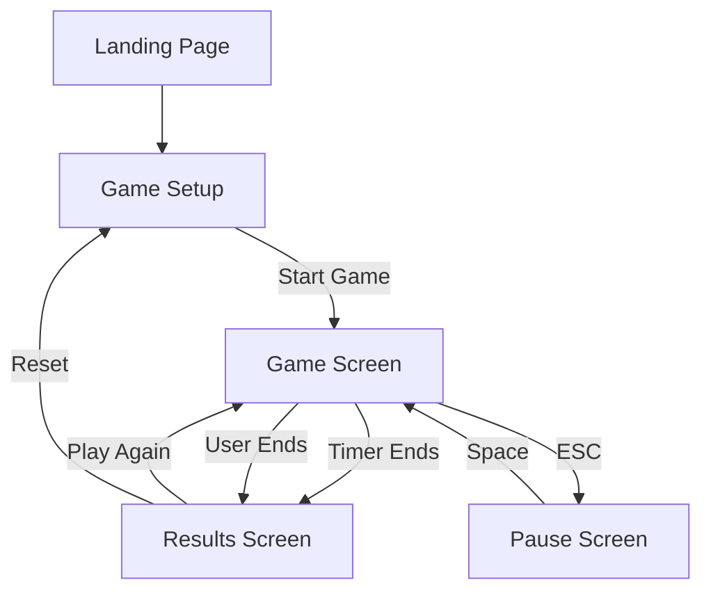

# Doomsday Game - Application Flow

## Core Routes
- `/` - Game setup/configuration
- `/game` - Active gameplay
- `/results` - Game results

## State Flow Diagram


## Screen-by-Screen Flow

### 1. Game Setup Screen
- Load saved settings from localStorage if available
- Display configuration form:
  - Timer duration input
  - Year range inputs
- Validate inputs:
  - Timer: 1-10 minutes
  - Start year ≤ End year
- "Start Game" button initiates game

### 2. Game Screen
- Initialize:
  - Generate question pool
  - Start timer
  - Reset score
- Game Loop:
  - Display current date
  - Start 40s question timer
  - Show hint indicators at intervals:
    - 10s: Century hint
    - 20s: Year hint
    - 30s: Month hint
    - 40s: Answer hint
  - Process user input (1-7)
  - Update display based on answer
  - Repeat until game timer ends

### 3. Results Screen
- Display:
  - Final score
  - Correct/incorrect counts
  - Average response time
  - High score
- Options:
  - "Play Again" - Same settings
  - "Reset" - Return to setup

## Data Flow

### Local Storage
- Settings:
  - Last used timer duration
  - Last used year range
  - High score
- Format:
```typescript
interface StoredSettings {
    timerMinutes: number;
    startYear: number;
    endYear: number;
    highScore: number;
}
```

### Game State
```typescript
interface GameState {
    currentDate: Date;
    score: number;
    correct: number;
    incorrect: number;
    timeRemaining: number;
    questionTime: number;
    hints: Hint[];
}

interface Hint {
    text: string;
    unlocked: boolean;
}
```
